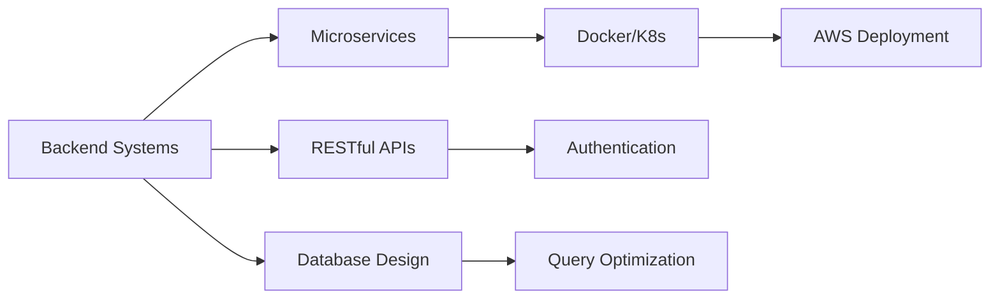

<div align="center">
  
# 🚀 Hello Everybody, I'm Madhu Sudhan Subedi!


<br/>

[](https://linkedin.com/in/madhusudhan1994)
[](https://madhusudhansubedi.com.np)
[](https://twitter.com/xmadhusudhan)

</div>

---

## 💫 About Me

```javascript
const madhu = {
    pronouns: "He" | "Him",
    code: ["JavaScript", "TypeScript", "Python", "Go"],
    askMeAbout: ["backend dev", "system design", "cloud architecture", "APIs"],
    technologies: {
        backend: {
            languages: ["Node.js", "Python", "Go"],
            frameworks: ["Express", "FastAPI", "Gin"],
            databases: ["PostgreSQL", "MongoDB", "Redis"]
        },
        cloud: ["AWS", "Docker", "Kubernetes"],
        tools: ["Git", "Postman", "VS Code", "Linux"]
    },
    currentFocus: "Building scalable microservices & mastering AWS",
    funFact: "I debug with console.log and I'm not ashamed! 🐛"
};
```

---

## 🛠️ Tech Stack

<div align="center">

### Languages


### Backend & Frameworks


### Databases


### Cloud & DevOps


### Tools & Others


</div>

---

## 🔥 Current Focus

```yaml
🎯 Working on: Building robust and scalable backend systems
📚 Learning: AWS Cloud Services & Go Programming
🌟 Goal: Master cloud-native architectures
💡 Interest: System Design, Microservices, API Development
```

---

## 📈 Contribution Graph

<div align="center">
  
</div>
---

## 💼 What I'm Working On



---

## 🤝 Let's Connect!

<div align="center">

💬 I'm always open to interesting conversations and collaboration opportunities!

📫 **Reach out to me:**

[](https://linkedin.com/in/madhusudhan1234)
[](https://twitter.com/xmadhusudhan)

<br/>


</div>

---

<div align="center">

### 💭 Quote of the Day


</div>

---

<div align="center">

**⭐️ From [Madhu Sudhan Subedi](https://github.com/madhusudhan1234)**

*"Code is like humor. When you have to explain it, it's bad." – Cory House*

</div>
